# Quant Trading OS

**A modular trading operating system for systematic quants: one pipeline from regime and data through backtesting and execution, with clear boundaries between intelligence, risk, and orders.**

---

## The problem this solves

Most quant workflows end up as a mess of notebooks, one-off scripts, and glued-together backtest vs live paths. Regime logic lives in one repo, portfolio in another; execution is an afterthought. Going from backtest to paper to live means rewriting integration points and hoping nothing breaks.

QuantTradingOS gives you a single architecture: the same pipeline and engine for research, backtesting, and execution. Agents (regime, sentiment, discipline) are pluggable layers. A single API and CLI runs everything. And agents don't just get static prompts — they navigate a live skill graph, pulling exactly the knowledge relevant to each decision at runtime.

---

## Safety-First by design

QuantTradingOS treats **safety and governance as first-class features**, not add-ons:

- **Safety-First MCP tooling** — policy-aware tools that inject Institutional Policy context (pgvector semantic search) before trading actions.
- **Hard-limit circuit breakers** — p90 volatility + exposure limits block unsafe orders with explicit error codes.
- **Strict schemas + corrective feedback** — stop-loss and limit-price are mandatory; missing fields trigger corrective feedback loops.
- **Enterprise decision logging** — every agentic decision logs Intent Category + Policy Result into ML-ready streams (ephemeral + immutable) to monitor drift.
- **Sandbox-first execution** — live broker wiring is gated and explicitly opt-in.

---

## Who this is for

- **Solo quants and small teams** who want a coherent stack instead of notebook sprawl — one pipeline, one API, reproducible backtests and paper trading.
- **Researchers** working on regime detection, execution quality, or agent-based trading who need a real engine and data layer to plug into.
- **Builders** who prefer modular, open components and clear contracts over a single black box.

## Who this is not for

- **Passive-income or "set and forget" seekers** — This is not a turnkey bot. You bring strategy logic and oversight.
- **High-frequency or tick-level trading** — Latency and microstructure are out of scope.
- **Beginners expecting one-click deployment and guaranteed outcomes** — This is a professional framework. We are transparent about what exists and what does not.

---

## Architecture


```
REVIEW (parallel): Trade journal, portfolio analyst — support humans.
```

**Orchestrator** runs the pipeline (regime → portfolio → [execution-discipline] → allocation → [guardian]) and exposes it via FastAPI and CLI. Before each agent call, it queries the skill graph and injects the most relevant knowledge nodes into the agent's context — no static prompts, no loading everything at once.

**Data-ingestion-service** ingests prices (yfinance), news, and insider data (Finnhub) on a schedule and persists everything to Supabase. Agents query clean internal endpoints instead of hitting external APIs directly.

**qtos-core** is the engine: backtesting, paper/sandbox execution, and (when wired) live execution through a broker adapter.

Intelligence agents feed context; control agents gate risk and discipline; execution is sandbox-first with a safety gate for live.

---

## How to read the architecture diagram

Four layers, top to bottom: **intelligence** (signals and context), **orchestration** (one pipeline), **core engine** (backtest + execution), and **control + execution** (risk and broker). Arrows show data flow. The **REVIEW** box runs in parallel — trade journal and portfolio analyst support humans and don't sit in the main order path.

Use the diagram to see where your work fits: a new regime classifier plugs into Intelligence; a new broker adapter plugs into Execution; a new knowledge node plugs into the skill graph.

---

## The skill graph

Agents don't load everything into context. They navigate.

The system contains 45 skill nodes distributed across 9 agents and a shared layer. Each node is a structured markdown file covering a specific domain: `circuit_breaker_logic`, `bear_market_behavior`, `bullish_insider_patterns`, `pipeline_sequencing_rules`, and so on.

**High-level flow** (all layers feed into traversal; traversal injects context before each agent call):

```mermaid
graph LR
    subgraph SOURCES["Skill node sources"]
        SHARED["🌐 Shared · 4 nodes"]
        INTEL["🧠 Intelligence · 3 agents · 13 nodes"]
        CONTROL["🛡️ Control · 3 agents · 13 nodes"]
        REVIEW["📊 Review · 2 agents · 8 nodes"]
        ORCH["⚙️ Orchestrator · 4 nodes"]
    end

    TRAVERSAL["🔍 Traversal: pgvector + cosine similarity + agent boost"]
    INJ["→ Context injected before agent call"]

    SHARED --> TRAVERSAL
    INTEL --> TRAVERSAL
    CONTROL --> TRAVERSAL
    REVIEW --> TRAVERSAL
    ORCH --> TRAVERSAL
    TRAVERSAL --> INJ
```



**All 45 skill nodes by agent** (reference):

| Layer | Agent | Skill nodes |
|-------|--------|-------------|
| **Shared** | — | `current_regime`, `portfolio_state`, `recent_decisions`, `verified_performance` (regime_agent, sentiment_agent, insider_agent) |
| **Intelligence** | Market Regime | bull_market, bear_market, sideways_market, high_volatility, regime_classification_rules |
| | Sentiment | positive_shift_signals, negative_shift_signals, noise_vs_signal, sector_specific_context |
| | Insider Intelligence | bullish_insider_patterns, bearish_insider_patterns, filing_types, materiality_thresholds |
| **Control** | Capital Guardian | circuit_breaker_logic, drawdown_rules, position_limits, volatility_thresholds, bear_market_behavior, bull_market_behavior |
| | Capital Allocation | position_sizing_rules, risk_limit_enforcement, regime_based_allocation, trade_gating_criteria |
| | Execution Discipline | plan_compliance_rules, regime_execution_standards, violation_categories, scoring_methodology |
| **Review** | Trade Journal Coach | behavioral_patterns, performance_metrics_interpretation, coaching_frameworks, common_trading_mistakes |
| | Portfolio Analyst | risk_metrics, performance_attribution, concentration_rules, rebalancing_signals |
| **Orchestrator** | — | pipeline_sequencing_rules, agent_weighting_logic, error_handling_patterns, fallback_behavior |

At runtime, before each agent call, the orchestrator does this:

```python
# Describe what's about to happen
task_context = "Pre-trade risk check. Proposed trade: BUY NVDA 100 shares. Drawdown: 8%. Regime: high_volatility."

# pgvector finds the most semantically relevant nodes for this exact context
nodes = traverse_skill_graph(task_context, agent_name="Capital-Guardian-Agent", top_k=5)

# Returns: circuit_breaker_logic, drawdown_rules, high_volatility — not all 45 nodes
skill_context = format_skill_context(nodes)

# Agent now has exactly what it needs for this situation
agent_prompt = skill_context + base_system_prompt + task
```

The agent gets 3-5 relevant nodes, dynamically resolved at runtime. Every node is indexed in Supabase with pgvector embeddings. Retrieval is cosine similarity with agent-boost scoring and related-node follow-through.

**Skill graph layers:**

| Layer | What's in it |
|-------|-------------|
| Agent-owned nodes | Knowledge specific to each agent's domain (e.g., Capital-Guardian-Agent owns `circuit_breaker_logic`, `drawdown_rules`) |
| Shared nodes | Cross-agent context: `current_regime`, `portfolio_state`, `recent_decisions` |
| Verified performance | Sigmodx-scored accuracy percentiles per agent, used as dynamic weights when combining signals |

The MCP tool `traverse_skill_graph` exposes this to the chatbot and external AI clients via natural language.

---

## Sigmodx integration

Intelligence agents (regime, sentiment, insider) submit forecasts to [Sigmodx](https://www.sigmodx.com) for probabilistic verification. Brier scores accumulate over time. Verified accuracy percentiles feed back into the orchestrator as dynamic weights when combining signals:

```python
weighted_signal = (
    regime_signal * regime_performance["skill_percentile"] +
    sentiment_signal * sentiment_performance["skill_percentile"] +
    insider_signal * insider_performance["skill_percentile"]
) / total_weight
```

Accuracy that hasn't been earned doesn't get weighted. The system gets harder to replicate the longer it runs.

---

## Use cases

- **Validate a strategy on history** — Use the data service and the orchestrator's `/backtest` endpoint; qtos-core runs the backtest and returns metrics. Same engine whether you call it from the API, CLI, or the chatbot.
- **Run the full pipeline on a schedule** — Orchestrator pulls regime, portfolio, and (optionally) execution-discipline and guardian; you get one combined decision. Run via CLI, API, or APScheduler.
- **Add a new regime or sentiment signal** — Implement an agent that fits the Intelligence layer and add skill nodes for it. The orchestrator already wires regime and sentiment into the pipeline.
- **Paper-trade with the same logic as backtest** — qtos-core's PaperBrokerAdapter uses the same strategy interface as backtesting. Swap to LiveBrokerAdapter without changing the engine.
- **Query prices, news, or insider data** — Data service exposes `/prices/{symbol}`, `/news/{symbol}`, `/insider/{symbol}`. Use from the orchestrator, your own code, or via MCP tools.
- **Ask the chatbot in natural language** — "What does the system do in high volatility?" → `traverse_skill_graph("high volatility")` → answers from actual system knowledge via pgvector, not hallucination.

---

## 10-minute first win

**1. Clone and run the full stack** (requires Docker):

```bash
docker-compose -f orchestrator/docker-compose.full.yml up --build
```

Starts the data service (with scheduled ingestion), the skill graph indexer, and the orchestrator API at `http://localhost:8000` and `http://localhost:8001`.

**2. Run a backtest**

```bash
curl -X POST http://localhost:8000/backtest \
  -H "Content-Type: application/json" \
  -d '{"symbol":"SPY","data_source":"data_service","period":"1y"}'
```

Returns PnL, Sharpe, CAGR, max drawdown from qtos-core.

**3. Run the full pipeline**

```bash
curl -X POST http://localhost:8000/decision
```

Orchestrator runs regime → portfolio → allocation → guardian. Each agent receives skill graph context before execution.

**4. Optional: try the chatbot**

Clone the [chatbot](https://github.com/QuantTradingOS/chatbot) repo, set `OPENAI_API_KEY` in `config/.env`, run `streamlit run app.py`. With the stack and [mcp-server](https://github.com/QuantTradingOS/mcp-server) available, ask in natural language for a backtest, prices, skill graph traversal, or to run the pipeline.

---

## What's implemented and what isn't

**Implemented**

- **Orchestration** — One pipeline (regime → portfolio → [execution-discipline] → allocation → [guardian]). FastAPI with `/decision` and agent endpoints; CLI; APScheduler for interval/cron.
- **Skill graph** — 45 skill nodes across 9 agents + shared layer. pgvector embeddings in Supabase. Traversal layer injects relevant nodes before each agent call. MCP tool for natural language queries.
- **Sigmodx integration** — Verified performance scores per agent feed back as dynamic weights in signal combination.
- **Data pipeline** — Scheduled ingestion (prices via yfinance, news and insider via Finnhub) into Supabase. FastAPI: `/prices/{symbol}`, `/news/{symbol}`, `/insider/{symbol}`. Agents query the internal service; no direct external API calls at decision time.
- **Core engine (qtos-core)** — EventLoop, Strategy, RiskManager, Portfolio; backtesting with OHLCV and metrics; PaperBrokerAdapter and LiveBrokerAdapter (sandbox-first, safety gate).
- **Intelligence agents** — Market regime, sentiment, insider signals (context only; they don't execute).
- **Risk & discipline** — Execution discipline evaluation; capital guardian (experimental).
- **Post-trade** — Trade journal coach, portfolio analyst.
- **AI interface (optional)** — MCP server (tools: `run_backtest`, `get_prices`, `get_news`, `get_insider`, `run_decision`, `traverse_skill_graph`); Streamlit chatbot using LangGraph + MCP.

**Not implemented (intentional)**

- **Live broker API wiring** — LiveBrokerAdapter and safety gate exist; real broker SDK calls (Alpaca, IBKR, etc.) are placeholders. Paper and sandbox work today.

---

## Architecture & status

| Layer | What it is | Status |
|-------|------------|--------|
| **Data** | Supabase + scheduled ingestion. FastAPI endpoints for prices, news, insider. | ✅ Done |
| **Skill graph** | 45 pgvector-indexed nodes. Traversal layer. Injected into agent context at runtime. | ✅ Done |
| **Orchestrator** | One pipeline, FastAPI, CLI, scheduler, Sigmodx-weighted signal combination. | ✅ Done |
| **Core & backtest** | qtos-core backtesting; orchestrator `/backtest`. | ✅ Done |
| **Execution** | Paper + LiveBrokerAdapter (sandbox); live broker placeholder. | Sandbox done |
| **Deploy** | Docker Compose: data-service + skill-indexer + orchestrator. | ✅ Done |
| **AI interface** | MCP server + chatbot + skill graph tool. | ✅ Done |
| **Live broker** | Alpaca/IBKR wiring, order lifecycle. | Planned |

---

## Repository map

| Repository | Category | Description |
|------------|----------|-------------|
| `orchestrator` | Core | Pipeline, FastAPI, CLI, scheduler, skill graph traversal. |
| `qtos-core` | Core | Event-driven engine: backtesting, Paper/Live adapters, safety gate. |
| `data-ingestion-service` | Core | Scheduled ingestion + Supabase persistence. FastAPI. Skill graph indexer. |
| `mcp-server` | Core | MCP tools: backtest, prices, news, insider, run_decision, traverse_skill_graph. |
| `chatbot` | Core | Streamlit + LangGraph; uses MCP tools. |
| `trading-os-framework` | Core | Shared libs and conventions. |
| `market-regime-agent` | Intelligence | Regime detection. 5 skill nodes. |
| `sentiment-shift-alert-agent` | Intelligence | News and sentiment. 4 skill nodes. |
| `equity-insider-intelligence-agent` | Intelligence | Insider signals. 4 skill nodes. |
| `capital-guardian-agent` | Control | Pre-trade risk (experimental). 5 skill nodes. |
| `capital-allocation-agent` | Control | Position sizing, gating (experimental). 4 skill nodes. |
| `execution-discipline-agent` | Control | Execution quality evaluation. 4 skill nodes. |
| `trade-journal-coach-agent` | Review | Trade journal and coaching. 4 skill nodes. |
| `portfolio-analyst-agent` | Review | Portfolio analytics. 4 skill nodes. |

**Categories:** Intelligence = signals/context; Control = risk & discipline; Review = post-trade; Core = infra, engine, orchestrator.

---

## Data and external APIs

**Data:** All agents query the **data-ingestion-service** (set `DATA_SERVICE_URL=http://data-service:8001`). The service ingests prices (yfinance), news and insider (Finnhub) on a schedule and persists to Supabase. Endpoints: `/prices/{symbol}`, `/news/{symbol}`, `/insider/{symbol}`.

**Inference:** Some agents use OpenAI (sentiment, insider reports, trade journal). Provide `OPENAI_API_KEY`. Skill graph embeddings use `text-embedding-3-small`. Finnhub keys at [finnhub.io](https://finnhub.io); OpenAI keys at [platform.openai.com](https://platform.openai.com/api-keys).

**Verified performance:** [Sigmodx](https://www.sigmodx.com) for probabilistic forecast verification and Brier scoring. Optional but recommended for production use.

---

## Getting started

- **Backtest only:** [qtos-core](https://github.com/QuantTradingOS/qtos-core) — clone, `pip install -e .`, run `PYTHONPATH=. python examples/buy_and_hold_backtest.py`.
- **Full pipeline:** [orchestrator](https://github.com/QuantTradingOS/orchestrator) — clone a workspace with orchestrator + agents, `pip install -r orchestrator/requirements.txt`, then `uvicorn orchestrator.api:app`.
- **Full stack (Docker):** `docker-compose -f orchestrator/docker-compose.full.yml up --build` from a workspace with `orchestrator/` and `data-ingestion-service/`. Orchestrator at `http://localhost:8000`, data service at `http://localhost:8001`.
- **Chatbot:** [chatbot](https://github.com/QuantTradingOS/chatbot) — requires stack + [mcp-server](https://github.com/QuantTradingOS/mcp-server); set `OPENAI_API_KEY`, then `streamlit run app.py`.

Individual repos: `git clone https://github.com/QuantTradingOS/<repo-name>`

---

## Repo README header convention

Each repo README should include a short header:

| Field | Purpose |
|-------|---------|
| **Status** | Active, Experimental, or Planned. |
| **Layer** | Intelligence, Control, Review, or Core. |
| **Integration** | Standalone or OS-integrated. |

Example: `**Status:** Active · **Layer:** Intelligence · **Integration:** Standalone`

---

## License

MIT unless stated otherwise in a specific repo.

---

*To update the org profile on [github.com/QuantTradingOS](https://github.com/QuantTradingOS): copy this file to the root `README.md` of the [QuantTradingOS/.github](https://github.com/QuantTradingOS/.github) repository and push.*
